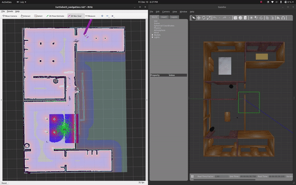
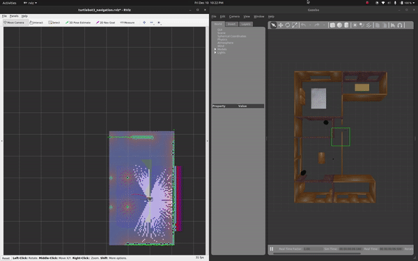

# Homework 4 SLAM Exploration
**Andru Liu**

## Overview
This repository contains a turtlebot3 navigation package to map an environment and navigate within the map using slam_toolbox. 

The package contains 4 launchfiles:

`start_slam.launch` - Starts the turtlebot3, loads rviz and visualizes the laser scan, starts a teleop node, and slam_toolbox. 

`nav_stack.launch` - Uses amcl to localize the robot and the ROS navigation stack to allow the robot to move using a pre-saved map. 

`slam_stack.launch` - Runs the same components as `nav_stack.launch` but uses slam_toolbox to create a map while navigating .

`explore.launch` - Launches the slam_toolbox and the explore node to autonomously map the environment. 

## Usage Instructions
1. To launch `start_slam.launch`, run `roslaunch homework4 start_slam.launch`
    Use the argument `launch_gazebo:=true` to launch in Gazebo and `launch_gazebo:=false` to launch on the robot. 

    With teleop launched, you can use the `w`, `x`, `a`, `d`, and `s` keys to explore the map. To save the explored map, run `rosrun map_server map_saver -f map`. 

2. To launch `nav_stack.launch`, run `roslaunch homework4 nav_stack.launch`
    Use the argument `launch_gazebo:=true` to launch in Gazebo and `launch_gazebo:=false` to launch on the robot. 

    Move the robot using the 2D navigation goals in `Rviz`. Video is at 1.5x speed.

    

3. To launch `slam_stack.launch`, run `roslaunch homework4 slam_stack.launch`
    Use the argument `launch_gazebo:=true` to launch in Gazebo and `launch_gazebo:=false` to launch on the robot. 

    Move the robot using the 2D navigation goals in `Rviz`. Video is at 1.8x speed.

    

4. To launch `explore.launch`, run `roslaunch homework4 explore.launch`
    Use the argument `launch_gazebo:=true` to launch in Gazebo and `launch_gazebo:=false` to launch on the robot. 

    

